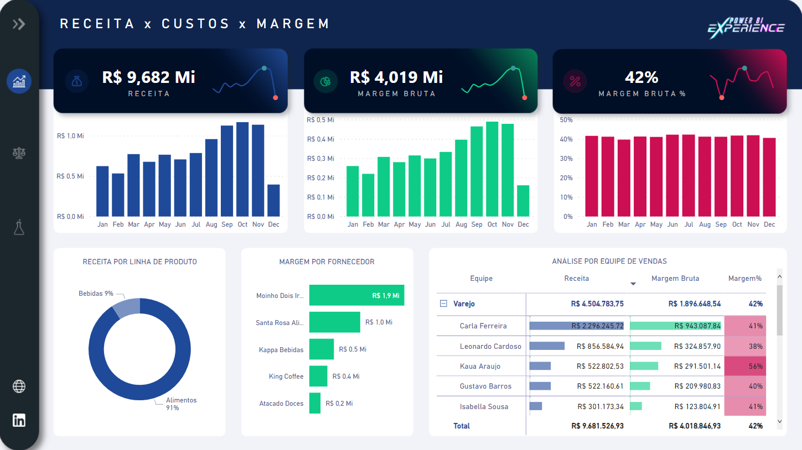
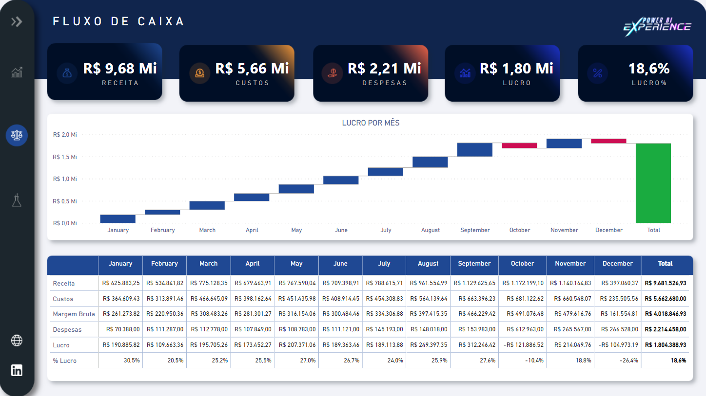

# MARATONA POWER-BI

### SOBRE O POWER-BI WEEK
 Essa semana é feita para o aprendizado e aplicação dos conhecimentos na prática, o projeto desenvolvido foi para visualização e demonstração de informações como produtos, despesas e receita. Aprendizagem focada em ETL: Extração, tratamento e carregamento dos dados.  
projeto desenvolvido durante a POWER-BI WEEK com Leonardo Karpinski.

## Receita x Custos

  

## Fluxo de Caixa

  

## Simulador

  

---
## 🚀 techs
- 🔗 [PowerBi](https://powerbi.microsoft.com/pt-br/)

--- 

## PASSOS

## Importação de arquivo excel

* OBTER DADOS( Excel )
* SELECIONAR AS PLANILHAS
* TRANFORMAR ( CADASTRO DE PRODUTOS )
	* COLUNA Cod Produto
	* transformar > Extrair > texto após o delimitador
		* Colocar Espaço
	* ALTERAR O TIPO PARA NUMERO INTEIRO	

## A Importancia da tabela calendário
Utilizada para a conexão de datas com inclusão de DRILL DOWN, ano, trimestre, mes, dia, horas ......

---

## 💻 Para que server as medidas?

Ao utilizar a própria coluna do conjunto de dados para somar os dados, pegar a média, o minimo, o máximo, essa são funções BUILT-IN chamadas de implicita.

Com a criação de médidas utilizando a linguagem DAX a mesma se tranforma em funções onde podemos utilizar em todo o projeto, e é chamado de função explicita onde o desenvolvedor deixa explicito o que a media deve fazer.

---

## 🎲 MODELO PARA CRIAÇÃO DE CALCULOS EXPLICITOS

 CRIAR UMA TABELA FAKE EM:
* pagina inicial > inserir dados
* renomear para Medidas
* criar as medidas de acordo as necessidades

---

## 🚧 RECOMENDAÇÃO

* Deixar todas as caixas assinaladas no caminho:
	* arquivo > opções e configurações > opções > recursos de visualização
* Deixar apenas as informações dos dados selecionados no grafico
	* arquivo > opções e configurações > opções > ARQUIVO ATUAL > configurações do relatório > OPÇÕES VISUAIS > alterar a interação visual padrão de realce cruzado para filtragem cruzada
---

### Author
Feito com ❤️ por Rafael Silva